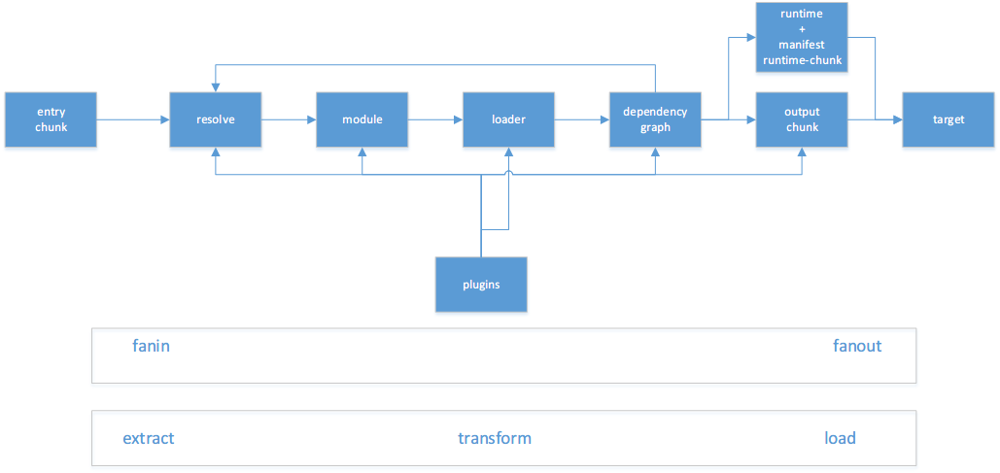

# nodejs模块学习： webpack

nodejs 发展很快，从 npm 上面的包托管数量就可以看出来。不过从另一方面来看，也是反映了 nodejs 的基础不稳固，需要开发者创造大量的轮子来解决现实的问题。

知其然，并知其所以然这是程序员的天性。所以把常用的模块拿出来看看，看看高手怎么写的，学习其想法，让自己的技术能更近一步。

## 引言

nodejs 的革命性的发展，给前端带来了无限可能。因为一直以来，对于前端来说，没有合适的工具进行处理手里的工作，对待 js，css，html 的工具要么不顺手，要么不是前端人写的，对前端的痛点不能够理解到位，nodejs 给于了前端工程师强大的能力，创造自己的工具。

对于网页来说在以前核心是以 html 为载体，css 定义形式，js 定义行为。现在的前端变化了，三要素没有变，只是生产三要素的工具，现在都变成了 javascript，这一个东西。 而 webpack 就是以 js 为核心，分析依赖，生产 html, css, js , assets等网页需要的一切东西。他的核心就是一切通过 js 进行模块化组织，然后自动分析依赖，构建出你想要的东西。官网上的图就能说明一切。

webpack 对于初学者很不简单，因为概念上带来很多新的东西，而且不可编程，不可控制，只能配置。

但我觉得 webpack 是不可多得的学习资料，他把一个构建一个系统做值很灵活，其中的概念对每个语言都是很有用。

## webpack 中的概念

### 入口（entry）
任何一个程序的都需要总的入口，它用来调用其他的模块。

### 出口 （output）
一般一个入口对应一个出口。
有定义发布的位置。

### 加载器（处理器） (loader)
处理程序的内容，以模块为单位进行处理。
先后顺须重要，是以文件为单位进行处理。

### 插件 (plugins)
控制 webpack 的行为，监听 webpack 编绎行为事件，然后进行相应的处理。
因此plugins的先后顺序不太重要。

### 模块 (modules)
是以文件为组织结构，如 .html, css, .less, .scss等
识别 html css js 中的 导入方案

### 依赖图 (Dependency Graph)
模块间调用的先后顺序，组后一个依赖图

### 块和模块区别
chunk是多个module在一起的概念

EntryChunk(包括运行时) 和 NormalChunk(不包括运行时)
一个出口有时不一定对应一个出口，有时会对应多个出口。

### 模块解析（resolve）
就是告诉你一些模块在哪里找，就是 require 中路径的问题

### 运行时（Runtime和Manifest）
依赖关系和 webpack 方法初始化调用方法。

### 构建目标环境 (target)
交叉遍绎（node, web，webworker）到目标环境。

## webpack 中的执行顺序

## 总结
webpack 就像是一个程序的程序，他能分析你程序的执行顺序和依赖，然后优化，打包成一个另一个优化好的程序。

webpack 可以看成元编程(meta-programing)

webpack 可以看成扇入扇出系统(fanin-finout)

webpack 可以看成ETL(extract-transform-load)

等等。

最后 webpack 就是webpack 没错，all-in-one。
